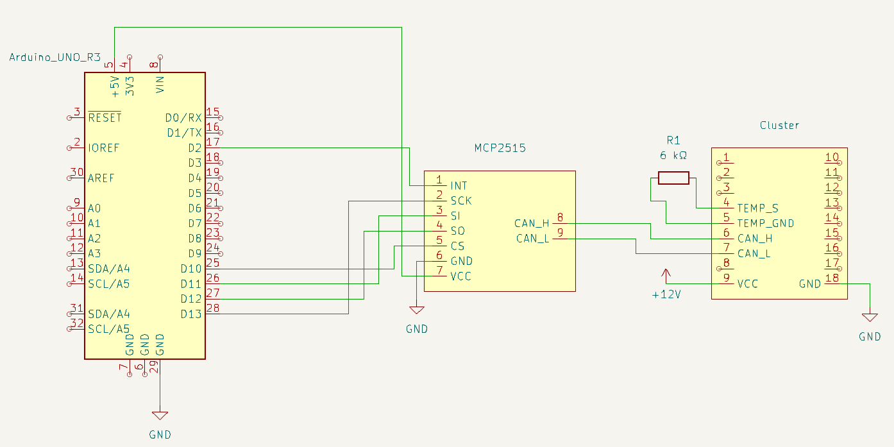

# Arduino CAN Cluster
Projekt integruje Arduino Uno, moduł CAN oraz licznik samochodowy z BMW E90 w celu wizualizacji danych z gier za pomocą aplikacji SimHub. 

---

## Spis treści
1. [Opis projektu](#opis-projektu)  
2. [Wymagania](#wymagania)  
3. [Instalacja](#instalacja)  
4. [Użycie](#użycie)  
5. [Funkcjonalności](#funkcjonalności)  
6. [Licencja](#licencja)  
7. [Kontakt](#kontakt)  

---

## Opis projektu
- Projekt umożliwia odczyt danych z gier i wizualizację ich na fizycznym liczniku samochodowym pochodzącym z BMW E90.  
- Wykorzystuje Arduino Uno jako jednostkę sterującą, moduł wykorzystujący układ MCP2515 oraz aplikację SimHub do konfiguracji i przesyłania danych.  
- W projekcie znajduje się kod Arduino oraz plik konfiguracyjny dla SimHub.  
- Projekt może być częścią symulatora jazdy lub platformy edukacyjnej do nauki CAN Bus.  

---

## Wymagania
- Arduino Uno.  
- Moduł CAN Bus (np. MCP2515).  
- Licznik samochodowy zgodny z CAN Bus.  
- Oprogramowanie:  
  - Arduino IDE do wgrania kodu na Arduino.  
  - Aplikacja SimHub do konfiguracji i przesyłania danych.  
- Pliki projektu:  
  - Kod Arduino (plik `.ino`).  
  - Konfiguracja SimHub (plik `.shsds`).  

---

## Instalacja
Instrukcja krok po kroku, jak skonfigurować i uruchomić projekt:  
1. Sklonowanie repozytorium:  
   ```bash
   git clone https://github.com/Adam-Sidor/CAN_Cluster
   ```
2. Wgranie kodu na Arduino:  
   - Otwórz plik `.ino` w Arduino IDE. 
   - Zainstaluj potrzebne biblioteki.
      - Jeśli nie posiadasz biblioteki do obsługi CAN, należy skopiować folder `CAN-0.3.1` do folderu z bibliotekami (na Windows domyślnie znajduje się w `Dokumentach`). 
   - Wybierz odpowiedni port COM oraz model Arduino.  
   - Wgraj kod na płytkę.  
3. Konfiguracja SimHub:  
   - Otwórz aplikację SimHub.
   - Utwórz nowe urządzenie w sekcji `Custom serial devices` 
   - Zaimportuj plik konfiguracyjny projektu klikając `Import settings`.  
   - Skonfiguruj połączenie z Arduino w sekcji `Serial settings`.  
4. Podłączenie sprzętu:  
   - Podłącz moduł CAN do Arduino oraz licznika samochodowego.  
   - Podłącz do licznika samochodowego zasilanie `+12V` oraz masę wszystkich płytek.  
   - Podłącz Arduino za pomocą kabla USB.
   - Jeśli chcesz pozbyć się komunikatu o zbyt niskiej temperaturze otoczenia należy umieścić rezystor o odpowiedniej rezystancji np. `6 kΩ`. Temperatura na liczniku zależy od dobranej rezystancji. W przypadku podanej wartości wyświetlana tamperatura wynosi ok. 18 ℃.
   - Schemat podłączenia:
   

---

## Użycie
1. Uruchom Arduino i upewnij się, że urządzenie jest poprawnie podłączone.  
2. Skonfiguruj SimHub, aby odczytywał dane z wybranej gry oraz komunikował się z Arduino.  
3. Obserwuj dane na liczniku samochodowym w czasie rzeczywistym.  

---

## Funkcjonalności
W zależności od gry niektóre z funkcjonalności mogą nie działać!   
- Integracja z aplikacją SimHub.  
- Wizualizacja danych na liczniku samochodowym. 
   - Prędkościomierz
   - Obrotomierz (Tachometr)
   - Wskaźnik poziomu paliwa (Czasem wymaga ponownego uruchomienia Arduino przyciskiem RESET)
   - Zegar wyświetlający czas systemowy komputera
   - Wskaźnik hamulca ręcznego
   - Wskaźniki kierunkowskazów
   - Światła
      - Pozycyjne
      - Mijania (Kontrolka świateł przeciwmgielnych przednich)
      - Drogowe (Długie)
      - Ostrzegawcze (Kontrolka świateł przeciwmgielnych tylnych)
      - Podświetlenie licznika zgodne z aktualnie włączonymi światłami
   - Wskaźnik temperatury (Stała wartość w zależności od dobranego rezystora podczas [Instalacji](#instalacja))

---

## Licencja
Wszystkie prawa zastrzeżone. Projekt został udostępniony wyłącznie w celach demonstracyjnych i edukacyjnych.  
- Możesz korzystać z tego projektu do użytku osobistego i edukacyjnego.  
- Wykorzystanie komercyjne lub redystrybucja projektu w całości lub w części wymaga wyraźnej pisemnej zgody autora.

---

## Kontakt
- Autor: Adam Sidor  
- E-mail: sidoadsi1@gmail.com  
- LinkedIn: [Mój profil](https://www.linkedin.com/in/adam-sidor-088a56341)  
